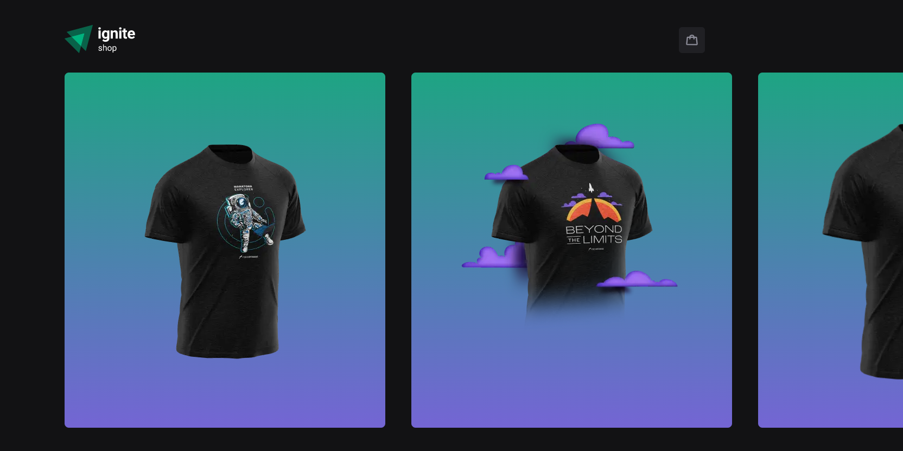
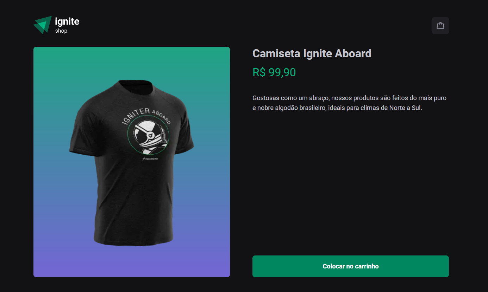
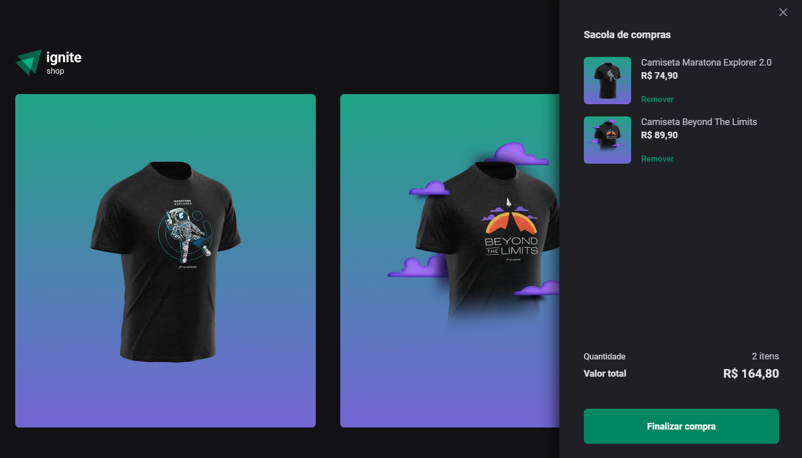
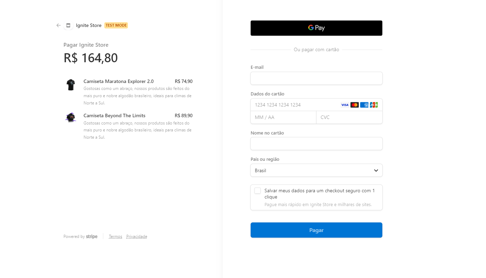
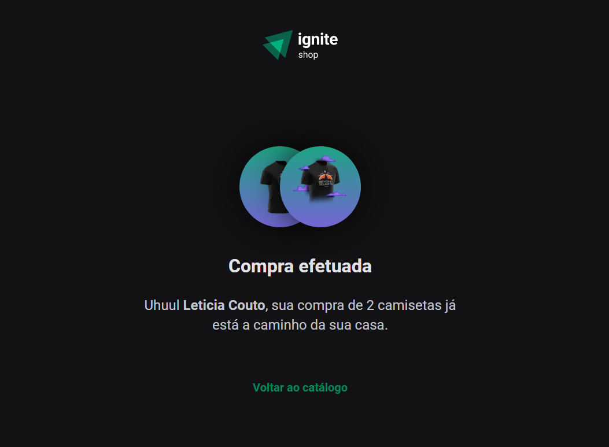

  

# 💻 Ignite Shop - E-Commerce

Venda de camisetas da ignite shop utilizando a Api da Stripe para armazenar/consumir as informações, além de redirecionamento para fazer o pagamento dos items.

- <a href="https://www.figma.com/file/RMIeUmaD9qZET3vfWmhmaI/Ignite-Shop-2.0-(Copy)?node-id=0%3A1" target="_blank">Layout Figma</a>

## 🚀 Tecnologias

- [NextJS](https://nextjs.org/)
- [TypeScript](https://www.typescriptlang.org/)
- [Stitches](https://stitches.dev/)
- [KeenSlider](https://keen-slider.io/)
- [RadixUI](https://www.radix-ui.com/)
- [Stripe](https://stripe.com/)

## 📑 Features

- Consumir Api da Stitches para pagamento e mostrar informações na aplicação;
- Carrossel das imagens usando Keen Slider;
- Rotas utilizando NextJS;

## 💡 Desafios

- Utilizar a listagem já criada da aplicação, mas a possibilidade de adicionar item ao carrinho da página do produto; ✔️
- Salvar todos os itens selecionados na aplicação, e exibir o número de items no carrinho; ✔️
- Criar component carrinho e modal dos items com Radix; ✔️
- Mudar layout da página Success para quando tiver +1 camiseta vendida; ✔️
- Enviar o carrinho que você armazenou na aplicação para a rota de checkout, onde irá gerar a sessão de checkout com os `line_items` necessários; ✔️

## 🖼️ Previews

| Home                               | Buy Product Modal                         |
| ---------------------------------- | ----------------------------------------- |
|  |  |

| CartItems                                | StripeApi                                |
| ---------------------------------------- | ---------------------------------------- |
|  |  |

| Success                                |
| -------------------------------------- |
|  |
